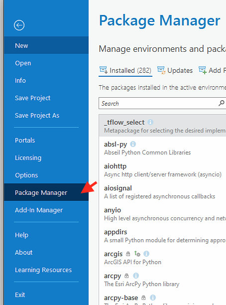
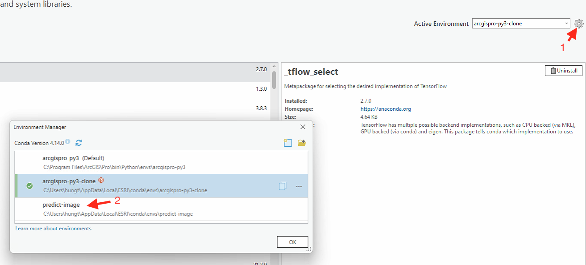
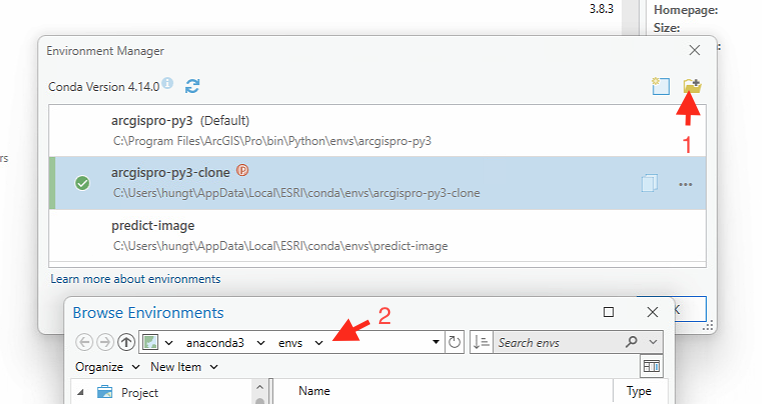
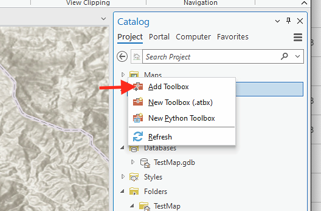
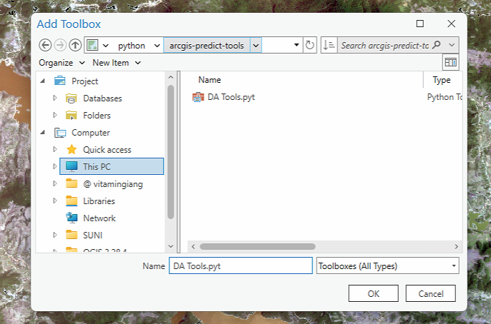
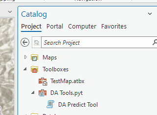
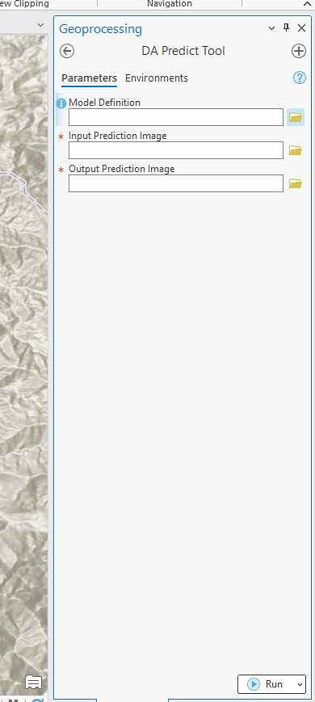
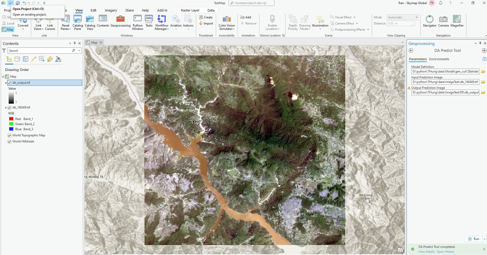

## Các bước để cài đặt toolbox "DA Tools" vào ArcGisPro v3.1.0

### Bước 1: Cài đặt `môi trường` trong ArcGisPro để chạy được `Toolbox`

- Tên mặc định là predict-image. Bạn có thể tự đổi tên môi trường

  ```
  conda create --name predict-image --file D:\python\THung\arcgis_predict.txt
  ```
- Nếu bạn đang sử dụng phiên bản conda của ArcGisPro thì sao khi tạo môi trường bạn sẽ thấy sẽ có môi trường được tạo ở trong phần "Package Manager"

  

  

  > Bạn chỉ cần active môi trường này lên để sử dụng là được

- Trường hợp bạn sử dụng phiên bản conda cài đặt trên máy tính của mình thì bạn cần tìm được đường dẫn chứa môi trường bạn vừa tạo ở trên. Nó sẽ nằm trong folder "envs"

  > Để thực hiện import một môi trường ngoài vào ArcGisPro. Bạn thực hiện lần lượt các bước 1 -> 2

  

  > Sau khi import xong thì sẽ tồn tại môi trường và bạn chỉ cần active môi trường này lên. Giống bước trên

### Bước 2: Thêm mới `Toolbox` trong ArcGisPro

- Sau khi cài đặt môi trường để chạy được môi trường thành công

- Để thêm `Toolbox`, click chuột phải và chọn `Add Toolbox`

  

- Sau đó chọn `DA Tools.pyt` để import 

  

### Bước 3: Sử dụng `Toolbox` trong ArcGisPro

- Sau khi thêm được Toolbox thành công, để sử dụng bạn chuột phải vào `DA Predict Tool` chọn `Open` để bắt đầu

  

- Các tham số đầu vào cho Tool

  

  > Bước 1: Chọn `model` để predict

  > Bước 2: Chọn đường dẫn đến file ảnh cần predict

  > Bước 3: Chọn nơi lưu trữ đầu ra

  > Bước 4: Sau khi cấu hình, chọn `Run` để chạy `Tool`

- Sau khi hoàn thành tiến trình, kết quả sẽ được hiển thị lên giao diện map hiện tại

  